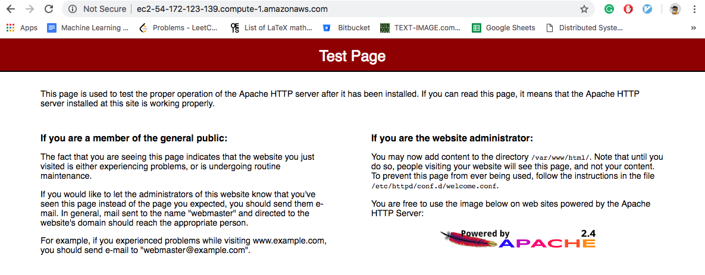
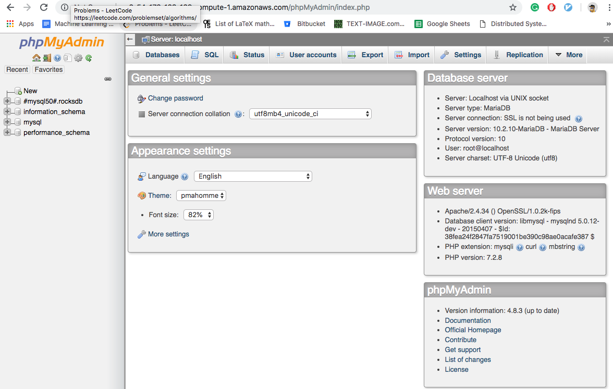
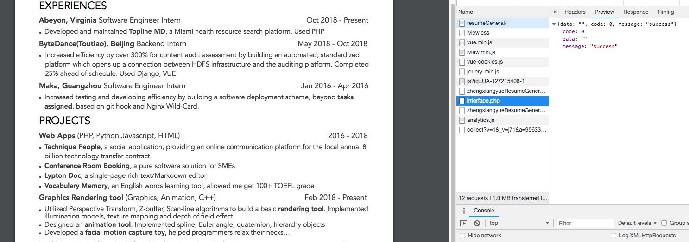

Distributed Systems Practice

Notes from learning about distributed systems in [GW CS 6421](https://gwdistsys18.github.io/) with [Prof. Wood](https://faculty.cs.gwu.edu/timwood/)

# Cloud Web Applications

### Virtualization

- Two different level of privilege to run on computers (Software)
  - Operating system
    - Use instructions
    - Access memory
    - Avoid the applications either maliciously or accidentally
  - Applications
    - Crashes won't take out the whole machine
- Hardware mechanism called Kernel mode Supervisor mode: ring 0
- If run multiple virtual machines on operating system and then run applications on top of that
  - The operating system is running on **user mode**
    - It will try to issue instructions and access things that it doesn't have permissions
    - The hardware provides easy-virtualized instructions
- Hypervisor runs on ring 0, the guest OS traps into the operating system
  - The performance of software emulation is not great
    - More instructions
    - Need to provides protections between domains

### Practice

>
> I want to know how many companies actually see my online resume. Thanks to the tutorial I could build a small service for my resume page, which is a pure front end page like github.io, to record the visit history

The note in this section would implement the "record visit" function, separately,  using

- LAMP - provide interface to add record for a website

#### Launch a VM

- Amazon Linux 2 AMI (HVM), SSD Volume Type - ami-0922553b7b0369273

#### Use S3 service to store the records
No permission. Skipped

#### Use LAMP server to record visits of a website

1. Follow the installation instruction to install `php, apache` and the relevant services

2. In **Security Group**, add In **bound Rule** for http/https service

3. Start server. It works

   

4. Install **mariadb** and db management tool phpmyadmin

   

5. Build a simple project to provide "add record" interface

   ```
   cd /var/www/html
   touch interface.php
   ```

   Allow some other domains to access the script

   ```php
   <?php
   header("Access-Control-Allow-Origin: *");
   ```

   Allow specific client domain to access

   ```php
   $config = array(
       'allow_hosts' => [
           'ec2-54-172-123-139.compute-1.amazonaws.com',
           'zhengxiangyue.github.io'
       ],
   );
   
   if ($_SERVER['HTTP_REFERER'] != null && !in_array(parse_url($_SERVER['HTTP_REFERER'], PHP_URL_HOST), $config['allow_hosts'])) {
       http_response_code(404);
       exit();
   }
   ```

   Create a database and tables for recording website visit record

   ```mysql
   CREATE TABLE `website_visit`.`record` ( 
       `id` INT NOT NULL AUTO_INCREMENT COMMENT 'ai_id' , 
       `info` TEXT CHARACTER SET utf8mb4 COLLATE utf8mb4_general_ci NOT NULL COMMENT 'record information in json' , 
       `create_time` TIMESTAMP NOT NULL DEFAULT CURRENT_TIMESTAMP , 
       PRIMARY KEY (`id`)) ENGINE = InnoDB;
   ```

   > Where `info` is a json format string that record the information we would love to record

   Write a simple database connector

   ```php
   class Database
   {
       private static $dbName = 'website_visit' ;
       private static $dbHost = 'localhost' ;
       private static $dbUsername = 'root';
       private static $dbUserPassword = '********';
   
       private static $cont  = null;
   
       public function __construct() {
           die('Init function is not allowed');
       }
   
       public static function connect()
       {
           // One connection through whole application
           if ( null == self::$cont )
           {
               try
               {
                   self::$cont =  new PDO( "mysql:host=".self::$dbHost.";"."dbname=".self::$dbName, self::$dbUsername, self::$dbUserPassword);
               }
               catch(PDOException $e)
               {
                   die($e->getMessage());
               }
           }
           return self::$cont;
       }
   
       public static function disconnect()
       {
           self::$cont = null;
       }
   
       public static function create($table, array $fields, array $values) {
   
           $numFields = count($fields);
           $numValues = count($values);
   
           if($numFields === 0 or $numValues === 0)
               throw new Exception("At least one field and value is required.");
           if($numFields !== $numValues)
               throw new Exception("Mismatched number of field and value arguments.");
   
           $fields = '`' . implode('`,`', $fields) . '`';
           $values = "'" . implode("','", $values) . "'";
           $sql = "INSERT INTO {$table} ($fields) VALUES($values)";
   
           return self::$cont->prepare($sql) and self::$cont->exec($sql);
       }
   
   }
   ```

   When there is a request, record all information in `$_SERVER`

   ```php
   Database::connect();
   Database::create('record', array('info'), array(json_encode($_SERVER)));
   Database::disconnect();
   ```

   Add a a-synchronize request on the front page

   ```javascript
   $.ajax({
       url: 'http://ec2-54-172-123-139.compute-1.amazonaws.com/interface.php',
       success: function(result){
           console.log(result);
       }
   });
   ```

6. Check the result

   


   > Great, now at least I know how many employers have checked my resume, or even their IP address to locate the company

7. During this process, some problems need to be pay attention to

   - Modify header to allow cross domain access

   - Http connection(our service) is not allowed through an https connection(front page), to solve this problem

     - Use https in the service url even though our service is not. This will cause the connection not a trusted connection
     - Configure our service to be an https connection
     - Both use http connections

The site which is using the service: https://zhengxiangyue.github.io/resumeGeneral/
And the site simply show the records: https://http://ec2-54-172-123-139.compute-1.amazonaws.com/show.php

Unfortunately, I do not have permission to create either `DynamoDB` with `Node.js` or  `S3 `with` AWS SDK`, which may also be used as backend script and database.

# Big Data and Machine Learning

- The solution to manage large amount of data is to use more machines, a distributed system
- A distributed system take less time to process data. But challenges are
  - high chances of system failure
  - High programming complexity
- Hadoop is a framework that allows for distributed processing of large data sets across clusters of commodity computers using simple programming models
  - high chances of system failure
  - High bandwidth problem
  - High programming complexity
- 4 key characteristics of Hadoop
  - Economical
    - Ordinary computers can be used for data processing
  - Reliable
    - Stores copies of the data on different machines and is resistant to hardware failure
  - Scalable
    - Can follow both horizontal and vertical scaling
  - Flexible
    - Can store as much of the data and decide to use it later
- Hadoop ecosystem
  - HDFS
    - A storage layer for Hadoop
    - Suitable for the distributed storage and processing
    - Hadoop provides a command line interface to interact with HDFS
    - Streaming access to file system data
    - Provides file permissions and authentication
  - HBASE
    - Stores data in HDFS
    - A NoSQL database or non-relational database
    - Mainly used when you need random, real-time, read/write access to your Big Data
    - Provides support to high volume of data and high throughput
    - The table can have thousands of columns
  - Sqoop
    - A tool designed to transfer data between Hadoop and relational database servers
    - It is used to import data from relational databases such as, Oracle and MySQL to HDFS and export data from HDFS to relational databases
  - Flume
    - A distributed service for ingesting streaming data
    - Ideally suited for event data from multiple systems
  - Spark
    - Provides 100 times faster performance as compared to MapReduce
    - Apache Spark
      - Spark Core and Resilient Distributed Datasets(RDDs)
      - Spark SQL
      - Spark Streaming
      - Machine Learning Library
      - GraphX
  - MapReduce
    - Based on the map and reduce programming model
    - An extensive and mature fault tolerance framework
  - Pig
    - An dataflow system
    - Converts the scripts to Map-Reduce code
  - Impala
    - High performance SQL engine runs on Hadoop cluster
    - Ideal for interactive analysis
    - Very low latency - measured in milliseconds
    - Supports a dialect of SQL
  - Hive
    - For data processing and extract transform load(ETL)
  - Cloudera
    - Nera rea-time access
    - Users do not need SQL or programming skills
    - A fully integrated data processing platform
  - Oozie is a workflow or coordination system used to manage the Hadoop jobs
  - Hue
    - Web interface for analyzing data with Hadoop
- Review 4 steps to process big data
  - Ingest
    - The data is transferred or ingested into hadoop from various sources such as
      - Relational databases
      - systems
      - Local files
    - `Scqop` transfers from RDB management system to HDFS
    - `Flume` transfers event data
  - Processing
    - Data stored in distributed file system `HDFS` and the NoSQL distributed data HBase
    - `Spark` and `MapReduce` perform the data processing
  - Analyze
    - Frameworks such as `Pig`, `Hive` and `Impala`
    - Converts data using map reduce, then analyze it
    - Hive is 
      - base on map reduce programming 
      - Most suitable for structured data
  - Access
    - `Hue`, `cloudera search`
      - Hue is the web interface
      - Clouderas provides a text interface for exploring data

