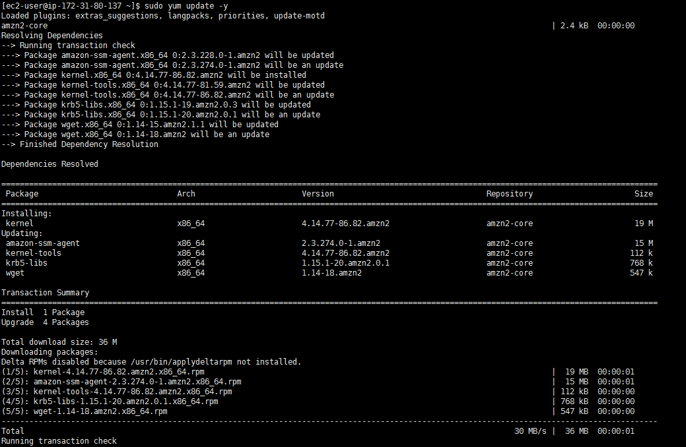
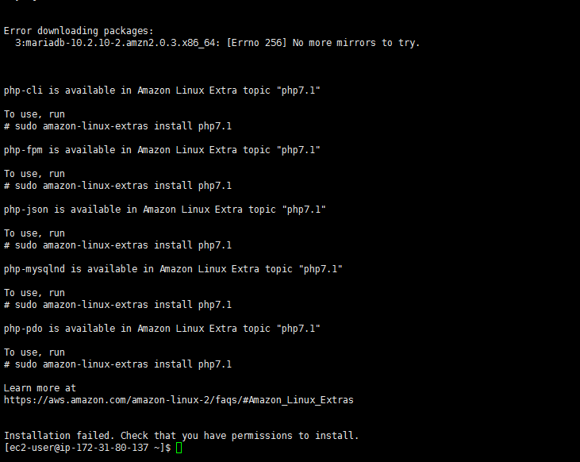
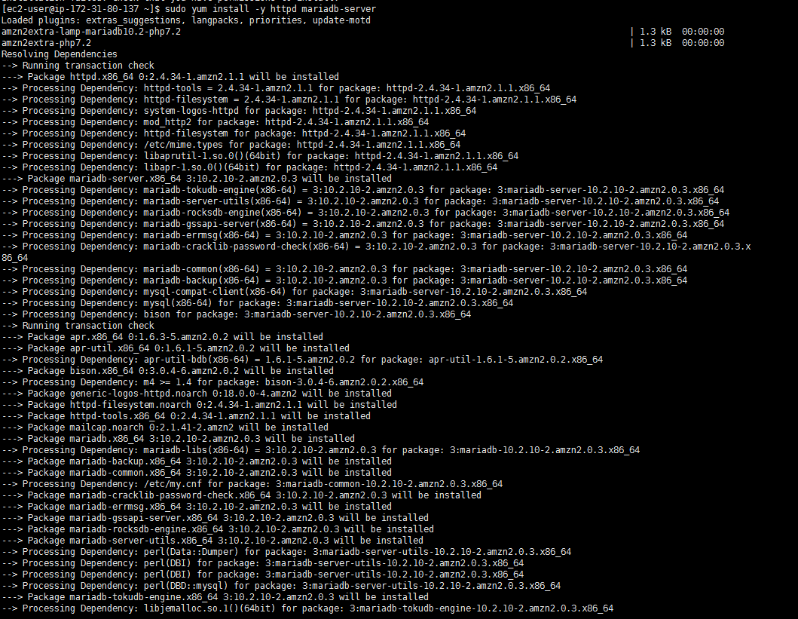
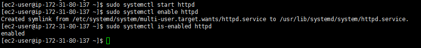
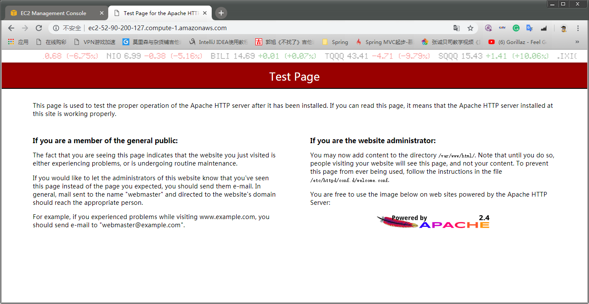
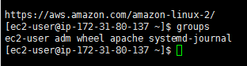
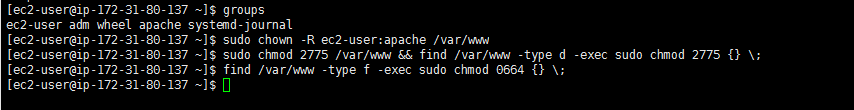
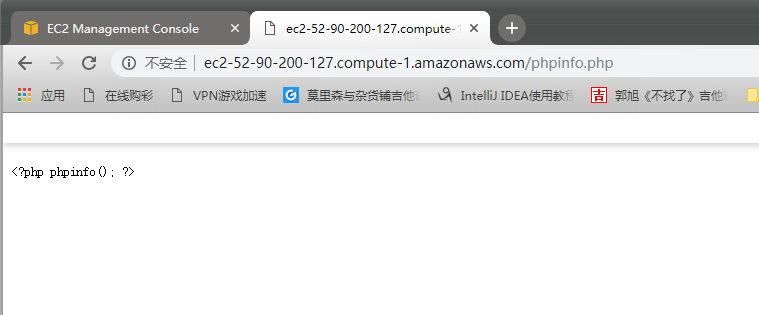

# Tutorial: Install a LAMP Web Server on Amazon Linux 2
## Step 1: Prepare the LAMP Server
- Create a new EC2 instance.
- Update the server
```
sudo yum update -y
sudo amazon-linux-extras install -y lamp-mariadb10.2-php7.2 php7.2
```



- Start the Apache web server
```
sudo systemctl start httpd
```
- Use the systemctl command to configure the Apache web server to start at each system boot.
```
sudo systemctl enable httpd
```

- Create security rule
- Open the Amazon EC2 console at https://console.aws.amazon.com/ec2/.
- Choose Instances and select your instance.
- Under Security groups, choose view inbound rules.

- Test the web server
- Enter DNS address in to browser
### DNS address: ec2-52-90-200-127.compute-1.amazonaws.com


- Set file permissions
- Add your user (in this case, ec2-user) to the apache group.
```
sudo usermod -a -G apache ec2-user
```
- Change the group ownership of /var/www and its contents to the apache group.
```
sudo chown -R ec2-user:apache /var/www
```
- To add group write permissions and to set the group ID on future subdirectories, change the directory permissions of /var/www and its subdirectories.
```
sudo chmod 2775 /var/www && find /var/www -type d -exec sudo chmod 2775 {} \;
```
- To add group write permissions, recursively change the file permissions of /var/www and its subdirectories:
```
find /var/www -type f -exec sudo chmod 0664 {} \;
```



## Test LAMP Server
- Create a PHP file in the Apache document root.
```
echo "<?php phpinfo(); ?>" > /var/www/html/phpinfo.php
```
- In a web browser, type the URL of the file that you just created. This URL is the public DNS address of your instance followed by a forward slash and the file name. For example:
```
http://my.public.dns.amazonaws.com/phpinfo.php
```


## Secure the Database Server
- Start the MariaDB server.
```
sudo systemctl start mariadb
```
- Run mysql_secure_installation.
```
sudo mysql_secure_installation
```
- (Optional) If you do not plan to use the MariaDB server right away, stop it. You can restart it when you need it again.
```
sudo systemctl stop mariadb
```

## Summary
From this Lab, I have learned how to deploy PHP in EC2, how to use the command "chmod" and how to PHP with MariaDB. 
