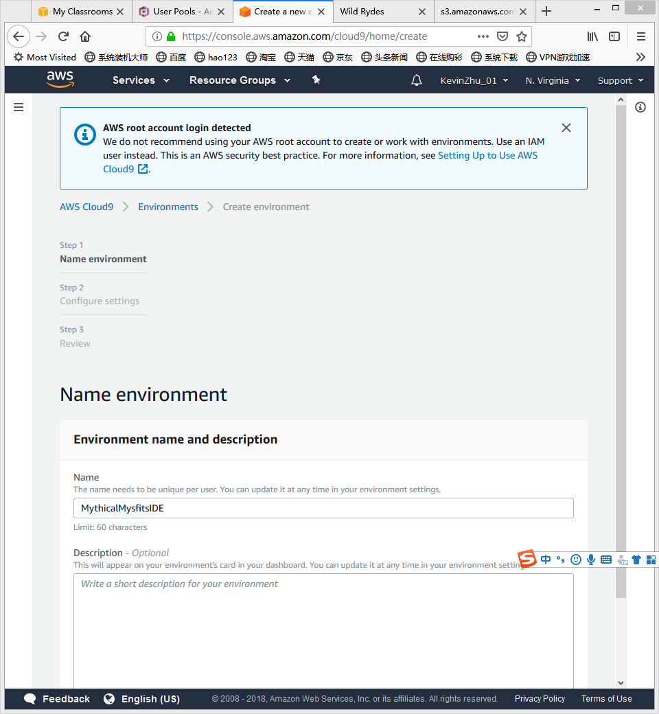
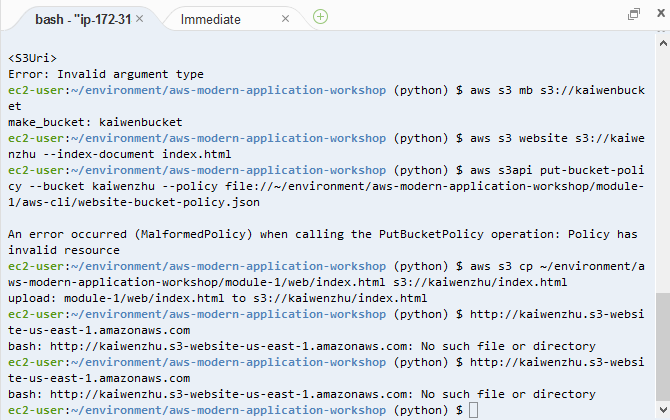
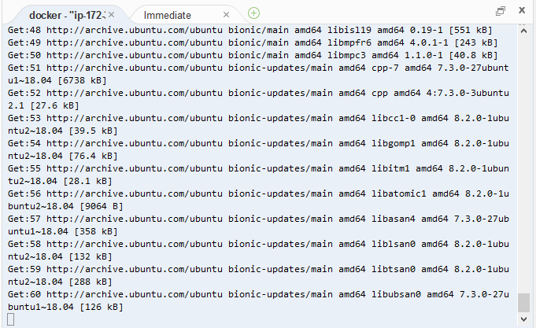
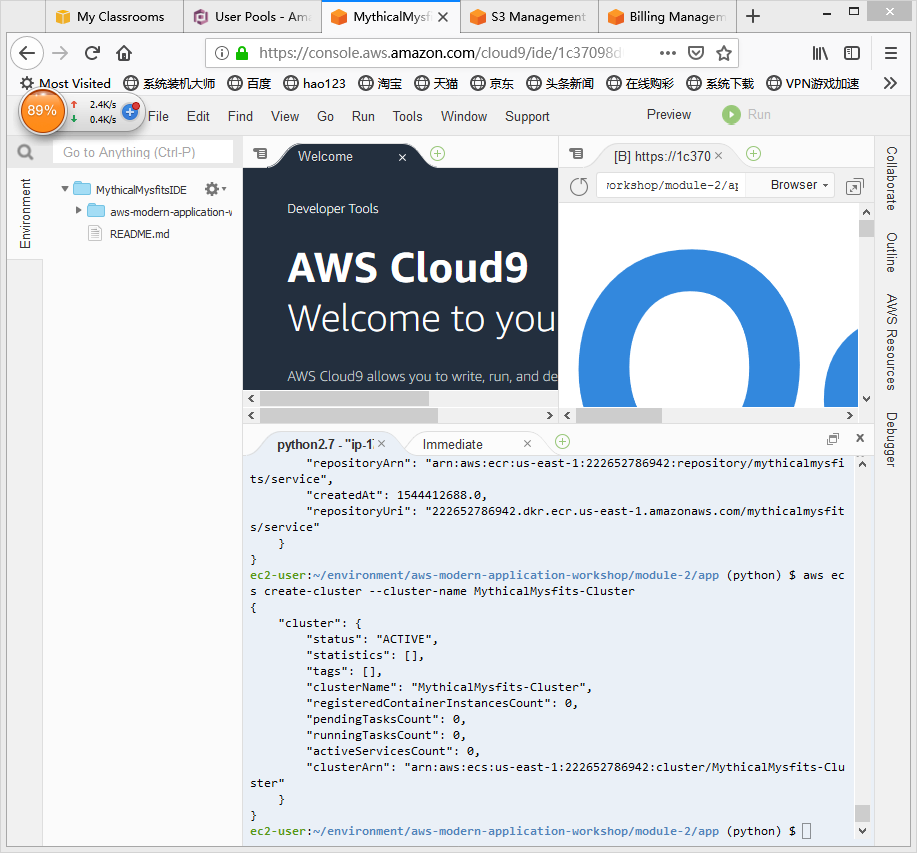
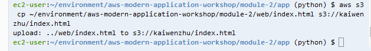
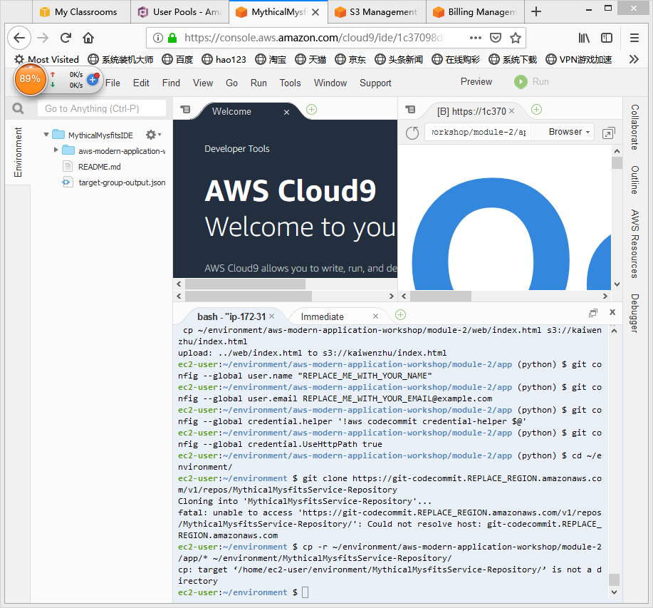
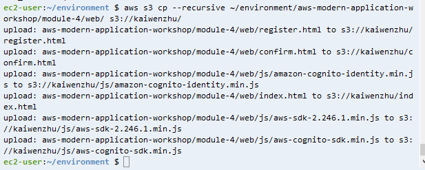
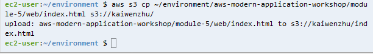

## Create Static Website
- Click Create Environment on the Cloud9 home page:
- Name it MythicalMysfitsIDE

>> In Cloud9, we can implement linux command
- Clone The Mythical Mysfits Workshop Repository
```
git clone -b python https://github.com/aws-samples/aws-modern-application-workshop.git
cd aws-modern-application-workshop
```
- Create An S3 Bucket And Configure It for Website Hosting
```
aws s3 mb s3://kaiwenzhu
aws s3 website s3://kaiwenzhu --index-document index.html
```
- Update The S3 Bucket Policy
```
aws s3api put-bucket-policy --bucket REPLACE_ME_BUCKET_NAME --policy file://~/environment/aws-modern-application-workshop/module-1/aws-cli/website-bucket-policy.json
```
- Publish The Website Content To S3
```
aws s3 cp ~/environment/aws-modern-application-workshop/module-1/web/index.html s3://REPLACE_ME_BUCKET_NAME/index.html 
```

## Setup Core Infrastructure
- Deploy CloudFormation Templates
```
aws cloudformation create-stack --stack-name MythicalMysfitsCoreStack --capabilities CAPABILITY_NAMED_IAM --template-body file://~/environment/aws-modern-application-workshop/module-2/cfn/core.yml
aws cloudformation describe-stacks --stack-name MythicalMysfitsCoreStack
```

## Deploy A Service With AWS Fargate
### Create a Flask Service
- Build A Docker Image
```
cd ~/environment/aws-modern-application-workshop/module-2/app
docker build . -t REPLACE_ME_AWS_ACCOUNT_ID.dkr.ecr.REPLACE_ME_REGION.amazonaws.com/mythicalmysfits/service:latest
```
### Test The Service Locally
```
docker run -p 8080:8080 REPLACE_ME_WITH_DOCKER_IMAGE_TAG
```
### Push the Docker Image to Amazon ECR
```
aws ecr create-repository --repository-name mythicalmysfits/service
```

- Login
```
$(aws ecr get-login --no-include-email)
```
- Push the image you created to the ECR repository
```
docker push REPLACE_ME_WITH_DOCKER_IMAGE_TAG
```
## Configure The Service Prequisites in Amazon ECS
- Create An AWS Fargate Cluster
```
aws ecs create-cluster --cluster-name MythicalMysfits-Cluster
```
- Create An AWS CloudWatch Logs Group
```
aws logs create-log-group --log-group-name mythicalmysfits-logs
```
- Register An ECS Task Definition
```
aws ecs register-task-definition --cli-input-json file://~/environment/aws-modern-application-workshop/module-2/aws-cli/task-definition.json
```

## Enable A Load Balanced Fargate Service
- Create A Network Load Balancer
```
aws elbv2 create-load-balancer --name mysfits-nlb --scheme internet-facing --type network --subnets REPLACE_ME_PUBLIC_SUBNET_ONE REPLACE_ME_PUBLIC_SUBNET_TWO > ~/environment/nlb-output.json
```
- Create A Load Balancer Target Group
```
aws elbv2 create-target-group --name MythicalMysfits-TargetGroup --port 8080 --protocol TCP --target-type ip --vpc-id REPLACE_ME_VPC_ID --health-check-interval-seconds 10 --health-check-path / --health-check-protocol HTTP --healthy-threshold-count 3 --unhealthy-threshold-count 3 > ~/environment/target-group-output.json
```
- Create A Load Balancer Listener
```
aws elbv2 create-listener --default-actions TargetGroupArn=REPLACE_ME_NLB_TARGET_GROUP_ARN,Type=forward --load-balancer-arn REPLACE_ME_NLB_ARN --port 80 --protocol TCP
```
## Update Mythical Mysfits To Call The NLB
- Replace the API Endpoint: Fill the value of mysfitsApiEndpoint 
- Upload To s3
```
aws s3 cp ~/environment/aws-modern-application-workshop/module-2/web/index.html s3://INSERT-YOUR-BUCKET-NAME/index.html
```

## Automate Deployments using AWS Code Services
- Create A S3 Bucket For Pipeline Artifacts
```
aws s3 mb s3://REPLACE_ME_CHOOSE_ARTIFACTS_BUCKET_NAME
```
- Grant access to this bucket to CI/CD pipeline
```
aws s3api put-bucket-policy --bucket REPLACE_ME_ARTIFACTS_BUCKET_NAME --policy file://~/environment/aws-modern-application-workshop/module-2/aws-cli/artifacts-bucket-policy.json
```
- Create a CodeCommit Repository
```
aws codecommit create-repository --repository-name MythicalMysfitsService-Repository
```
- Create a CodeBuild Project
```
aws codebuild create-project --cli-input-json file://~/environment/aws-modern-application-workshop/module-2/aws-cli/code-build-project.json
```
- Create a CodePipeline Pipline
```
aws codepipeline create-pipeline --cli-input-json file://~/environment/aws-modern-application-workshop/module-2/aws-cli/code-pipeline.json
```
- Test The CI/CD Pipeline
```
git config --global user.name "REPLACE_ME_WITH_YOUR_NAME"
git config --global user.email REPLACE_ME_WITH_YOUR_EMAIL@example.com
git config --global credential.helper '!aws codecommit credential-helper $@'
git config --global credential.UseHttpPath true
cd ~/environment/
git clone https://git-codecommit.REPLACE_REGION.amazonaws.com/v1/repos/MythicalMysfitsService-Repository
cp -r ~/environment/aws-modern-application-workshop/module-2/app/* ~/environment/MythicalMysfitsService-Repository/
```

- Pushing A Code Change
```
cd ~/environment/MythicalMysfitsService-Repository/
git add .
git commit -m "I changed the age of one of the mysfits."
git push
```
## Store Mysfit Information
- Addring A NoSQL Database To Mythical Mysfits
- Create A DynamoDB Table
```
aws dynamodb create-table --cli-input-json file://~/environment/aws-modern-application-workshop/module-3/aws-cli/dynamodb-table.json
aws dynamodb describe-table --table-name MysfitsTable
aws dynamodb scan --table-name MysfitsTable
```
- Add Items To The DynamoDB Table
```
aws dynamodb batch-write-item --request-items file://~/environment/aws-modern-application-workshop/module-3/aws-cli/populate-dynamodb.json
```
- Commit First Real Code Change
- Copy The UpdateD Flask Service Code
```
cp ~/environment/aws-modern-application-workshop/module-3/app/service/* ~/environment/MythicalMysfitsService-Repository/service/
```
- Copy The Updated Flask Service Code
```
cd ~/environment/MythicalMysfitsService-Repository
git add .
git commit -m "Add new integration to DynamoDB."
git push
```
## Setup User Registration
- Create The Cognito User Pool
```
aws cognito-idp create-user-pool --pool-name MysfitsUserPool --auto-verified-attributes email
```
- Create A Cognito User Pool Client
```
aws cognito-idp create-user-pool-client --user-pool-id REPLACE_ME --client-name MysfitsUserPoolClient
```
- Create An API Gateway VPC Link
```
aws apigateway create-vpc-link --name MysfitsApiVpcLink --target-arns REPLACE_ME_NLB_ARN > ~/environment/api-gateway-link-output.json
```
- Create The REST API Using Swagger
```
aws apigateway import-rest-api --parameters endpointConfigurationTypes=REGIONAL --body file://~/environment/aws-modern-application-workshop/module-4/aws-cli/api-swagger.json --fail-on-warnings
```
- Deploy The API
```
aws apigateway create-deployment --rest-api-id REPLACE_ME_WITH_API_ID --stage-name prod
https://REPLACE_ME_WITH_API_ID.execute-api.REPLACE_ME_WITH_REGION.amazonaws.com/prod
```
- Update the Flask Service Backend
```
cd ~/environment/MythicalMysfitsService-Repository/
cp -r ~/environment/aws-modern-application-workshop/module-4/app/* .
git add .
git commit -m "Update service code backend to enable additional website features."
git push
```

- Update The Mythical Mysfits Website In S3
```
aws s3 cp --recursive ~/environment/aws-modern-application-workshop/module-4/web/ s3://YOUR-S3-BUCKET/
```

## Capture User Behavior
- Create A New CodeCommit Repository
```
aws codecommit create-repository --repository-name MythicalMysfitsStreamingService-Repository
cd ~/environment/
git clone {insert the copied cloneValueUrl from above}
```
- Copy The Streaming Service Code Base
```
cd ~/environment/MythicalMysfitsStreamingService-Repository/
cp -r ~/environment/aws-modern-application-workshop/module-5/app/streaming/* .
cp ~/environment/aws-modern-application-workshop/module-5/cfn/* .
```
- Update The Lambda Function Package And Code
- Use Pip To Install Lambda Function ependencies
```
pip install requests -t
```
- Update The Lambda Function Code
- Push Code Into CodeCommit
```
git add .
git commit -m "New stream processing service."
git push
```
- Create An S3 Buckeet For Lambda Function Code Packages
- Use The SAM CLI To Package Code For Lambda
```
sam package --template-file ./real-time-streaming.yml --output-template-file ./transformed-streaming.yml --s3-bucket replace-with-your-bucket-name
```
- Deploy The Stack Using AWS CloudFormation
```
aws cloudformation deploy --template-file /home/ec2-user/environment/MythicalMysfitsStreamingService-Repository/cfn/transformed-streaming.yml --stack-name MythicalMysfitsStreamingStack --capabilities CAPABILITY_IAM
```
- Update The Website Content
```
aws cloudformation describe-stacks --stack-name MythicalMysfitsStreamingStack
```
- Push The New Site Version to S3
```
aws s3 cp ~/environment/aws-modern-application-workshop/module-5/web/index.html s3://YOUR-S3-BUCKET/
```

