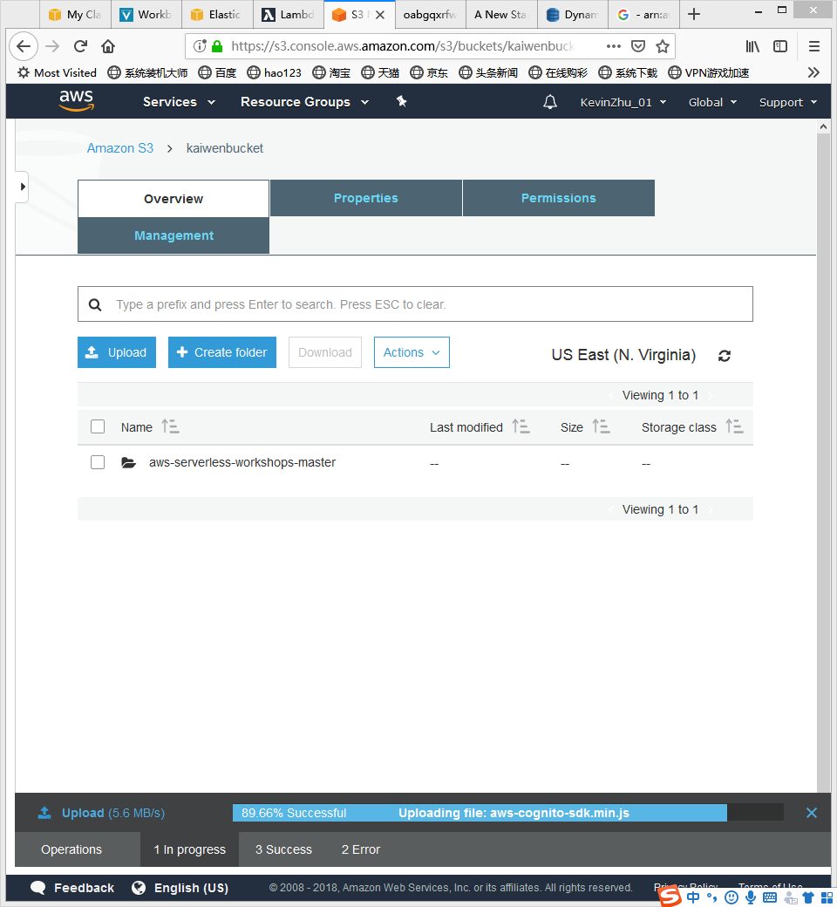
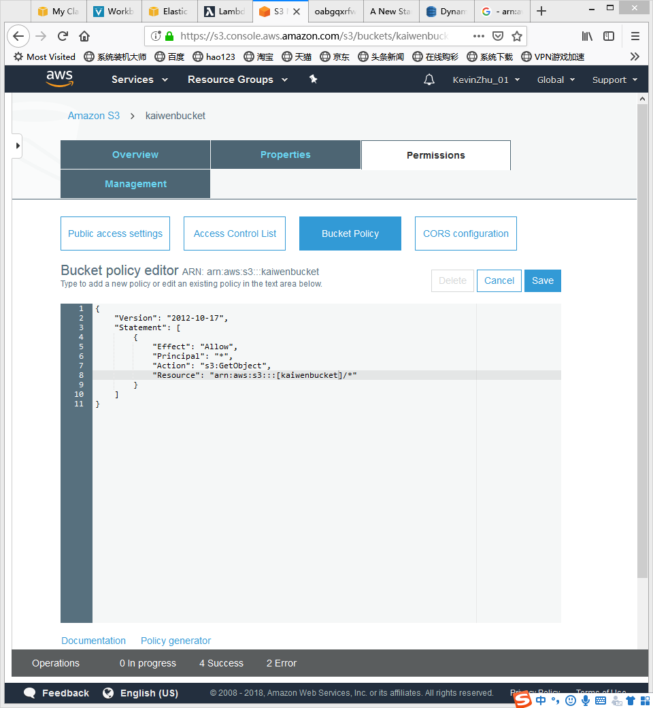
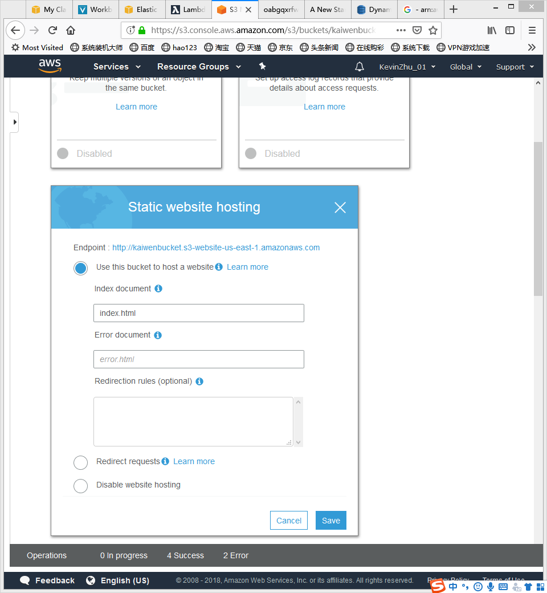
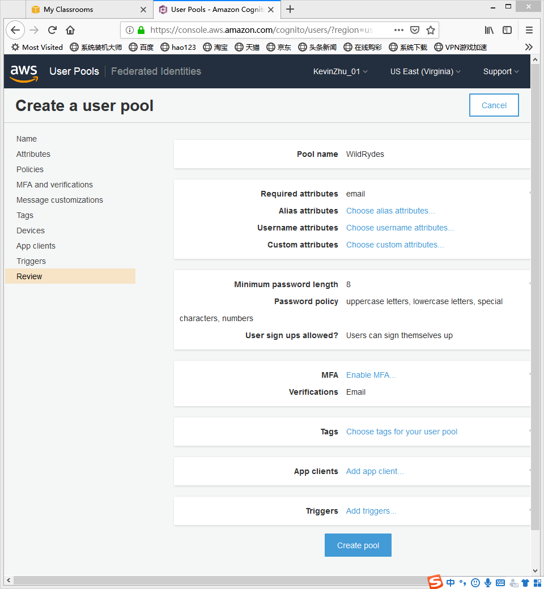
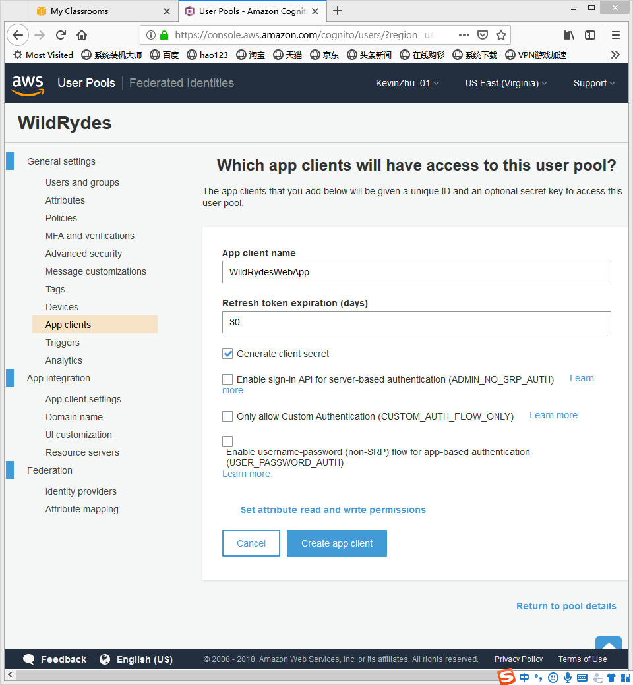
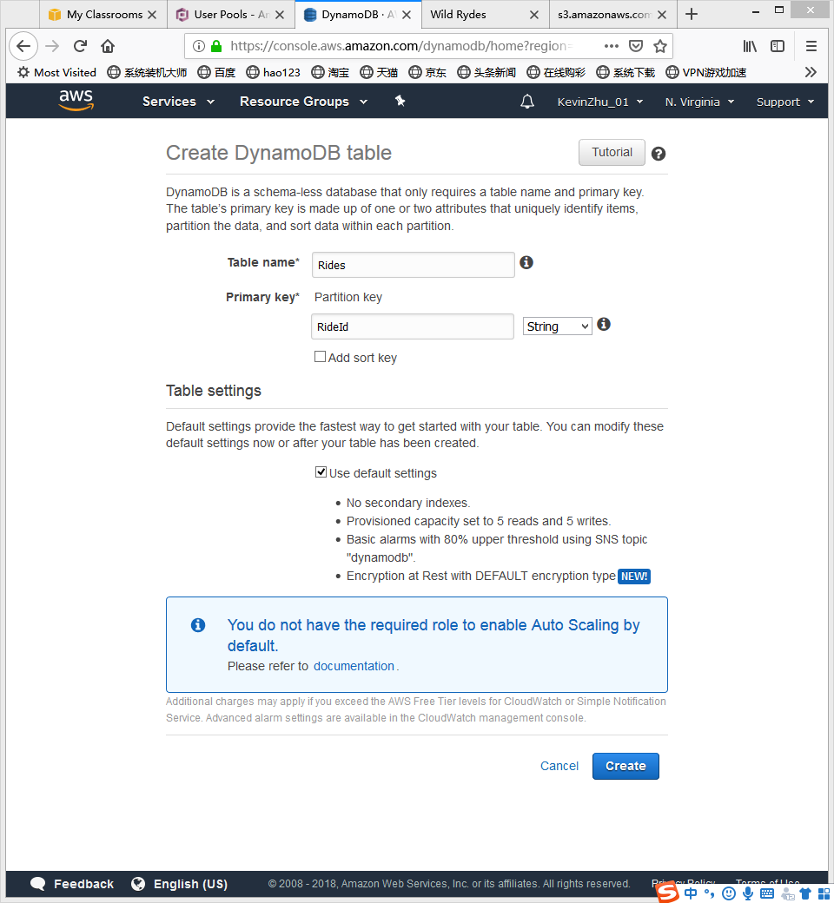
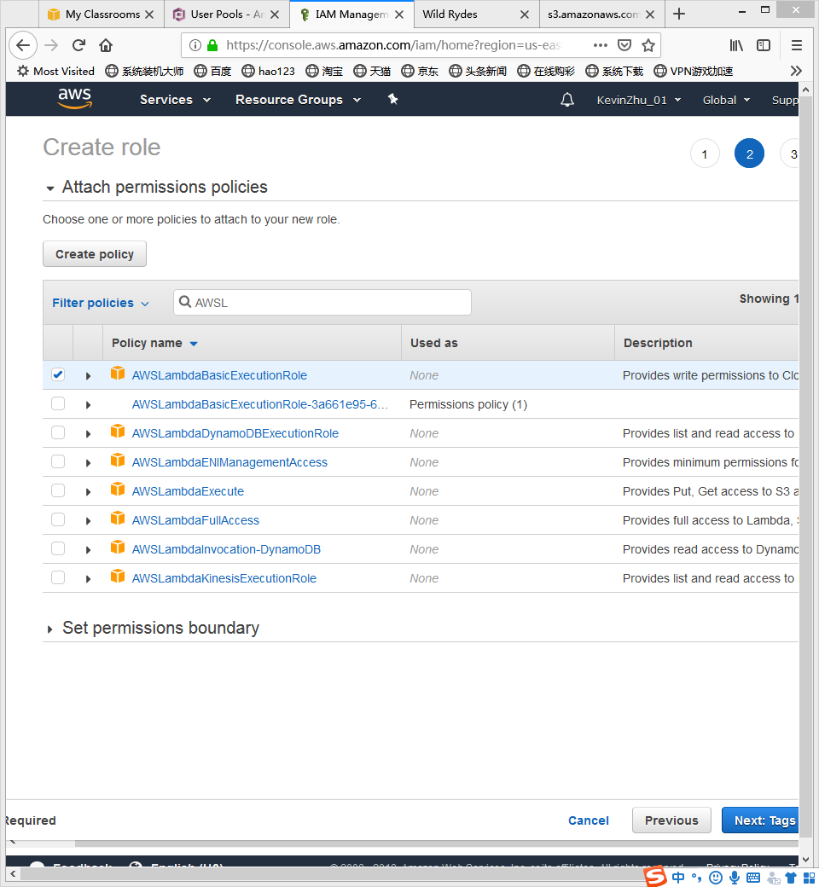
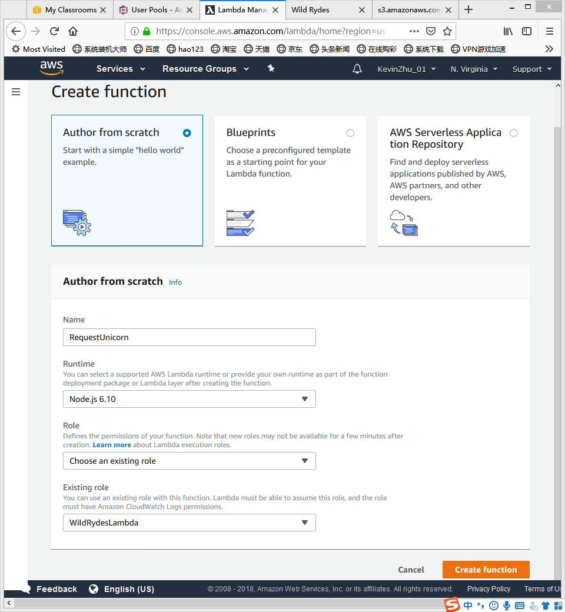
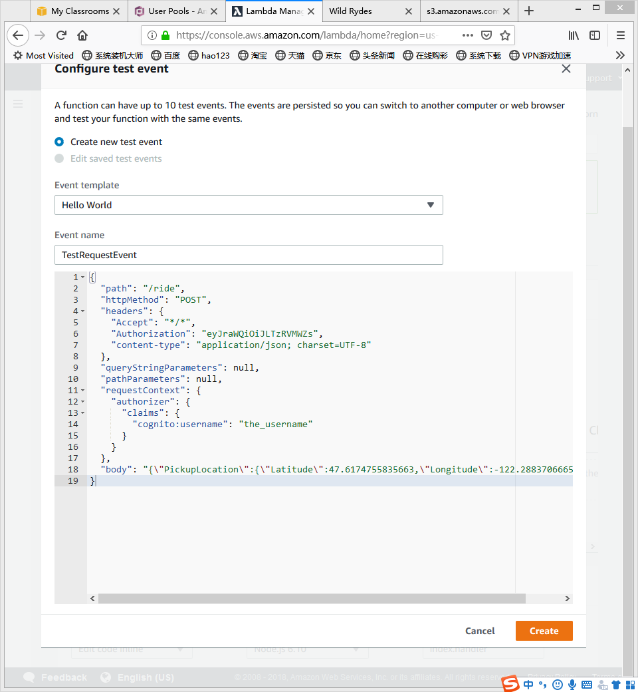
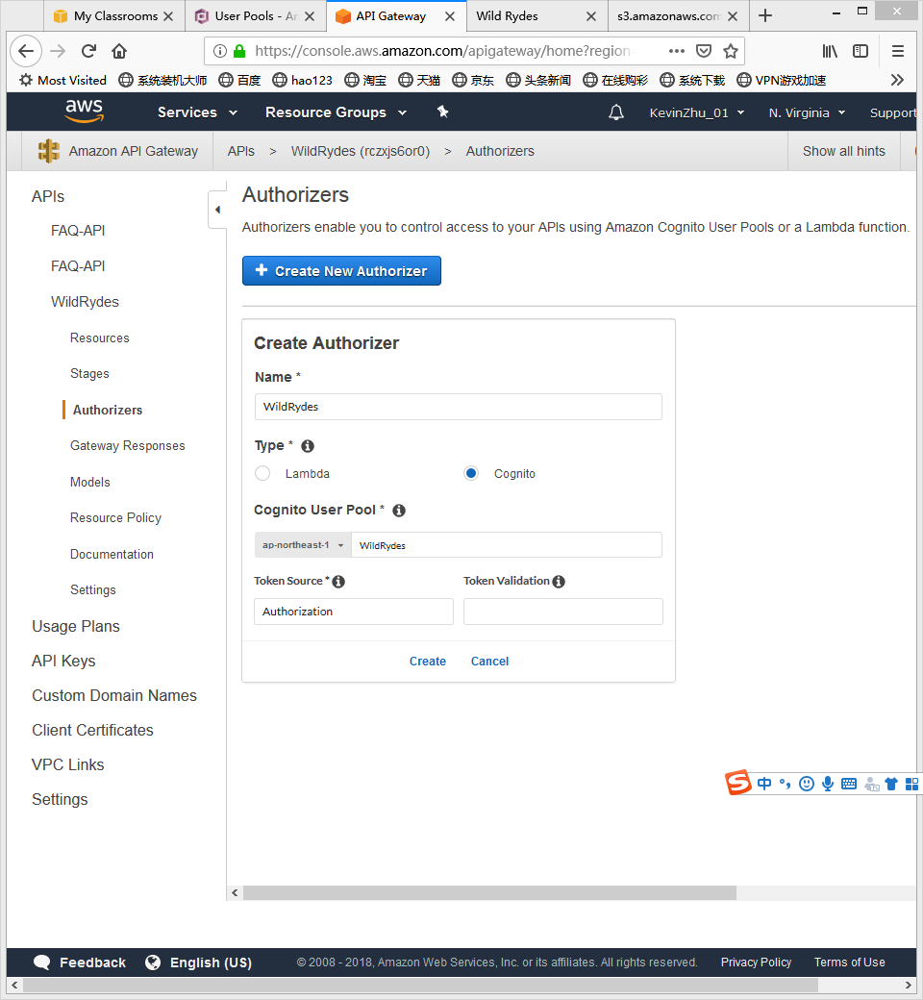

## Host a Static Website
### Create S3 Bucket

- Set the S3 policy


## Manage users
- Create an Amazon Cognite User Pool
- Add an App to User Pool




## Serverless Service Backend
- Create an Amazon DynamoDB Table

- Create an IAM Role for Your Lambda function
- Set the policy


## Create a Lamdba Function for Handling Requests
- Deploy a RESTful API


- Create a Cognito User Pools Authorizer

- Create a new resource and method

- Deploy API

- Update the Website Config
> Update the invokeUrl setting under the api key in the config.js file. Set the value to the Invoke URL for the deployment stage your created in the previous section.
```
window._config = {


    cognito: {


        userPoolId: 'us-west-2_uXboG5pAb', // e.g. us-east-2_uXboG5pAb         


        userPoolClientId: '25ddkmj4v6hfsfvruhpfi7n4hv', // e.g. 25ddkmj4v6hfsfvruhpfi7n4hv


        region: 'us-west-2' // e.g. us-east-2 


    }, 


    api: { 


        invokeUrl: 'https://rc7nyt4tql.execute-api.us-west-2.amazonaws.com/prod' // e.g. https://rc7nyt4tql.execute-api.us-west-2.amazonaws.com/prod, 


    } 


};
```
