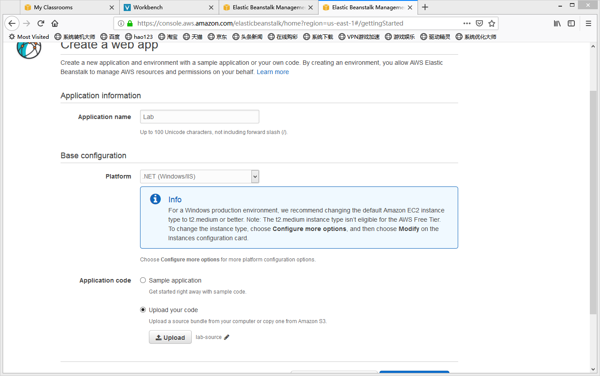
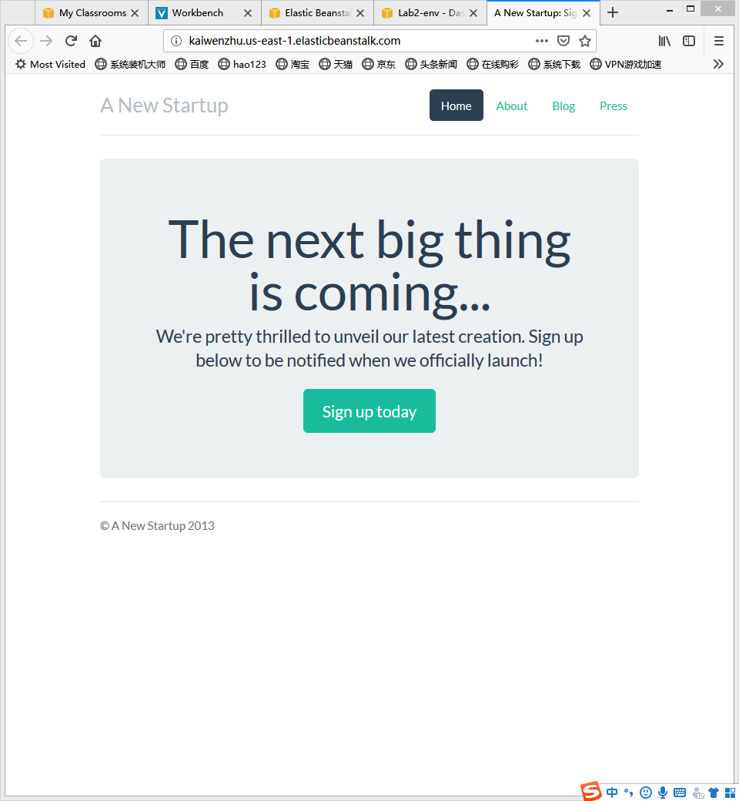

# Deploying a Node.js Application with DynamoDB to Elastic Beanstalk

# Prerequisites
- Install eb-node-express-sample-v1.1.zip
- Launch an Elastic Beanstalk Environment
> - Choose Sample application
> - Plaftform choose Node.js
> - Review and launch 
> - Upload eb-node-express-sample-v1.1.zip
- Elastic Beanstalk provisions one or more AWS resources, such as Amazon EC2 instances. 
The software stack that runs on your Amazon EC2 instances depends on the configuration.

# Add Permissions
We need to set the security rule for Elastic Beanstalk, for making sure it can be accessed.
- AmazonDynamoDBFullAccess
- AmazonSNSFullAccess

# Test
- Type the address in the browser we can see the website.

# Create a DynamoDB Table
- The table
> - Table name - nodejs-tutorial 
> - Primary key - email
> - Primary key type - String

# Update the Application's Configuration Files
- For connecting to Dynomadb, we need to modify the program.
- Open .ebextensions/options.config and change the values of the following settings:
> - NewSignupEmail – Your email address.
> - STARTUP_SIGNUP_TABLE – nodejs-tutorial

# Summary
- From this lab, we can known how to use Elastic Beanstalk. It's a easy-deploy service that don't need to be configured. 
We only need to upload the source code. 
