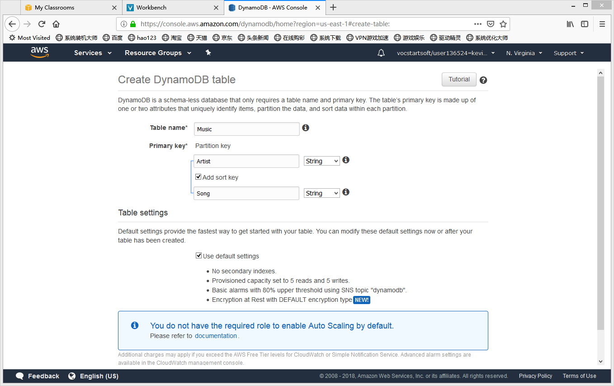
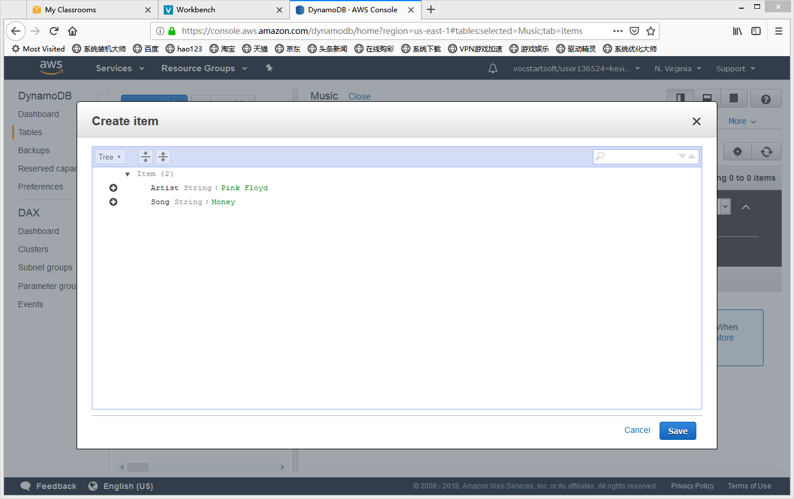
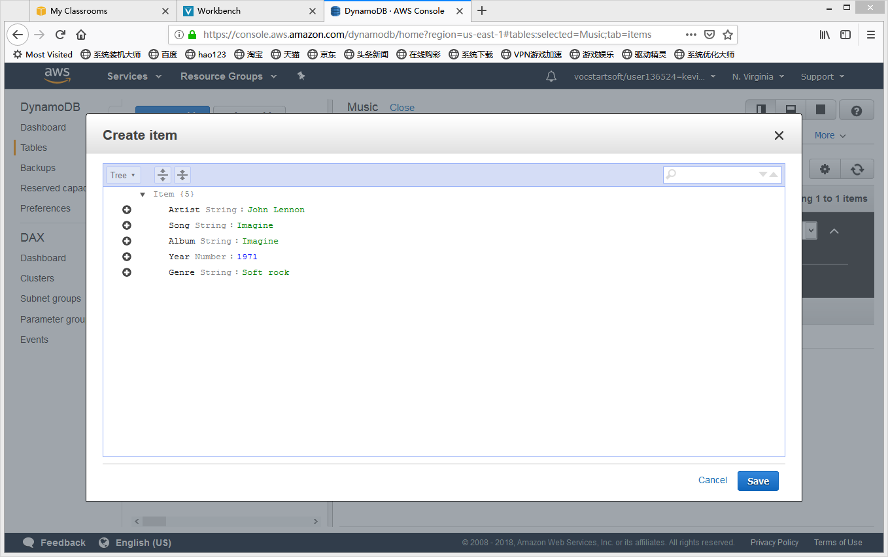
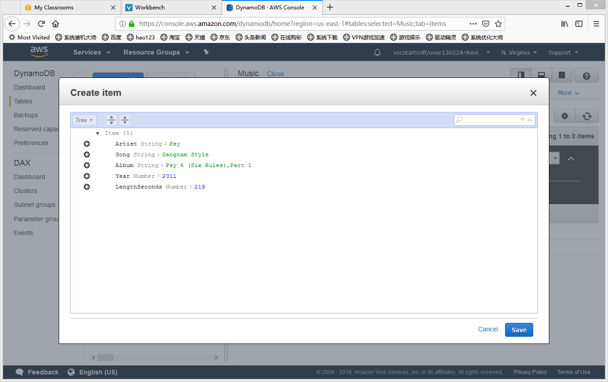
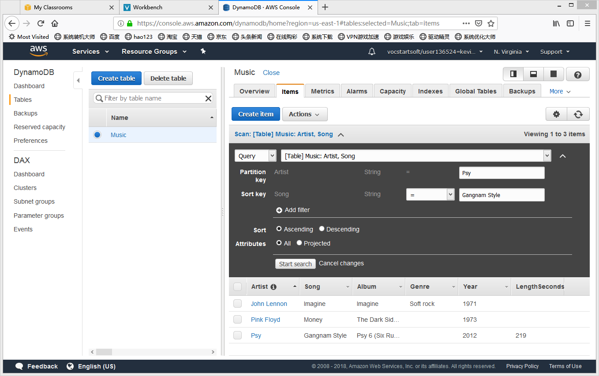

# Introduction to AWS DynamoDB

## Create a New Table
- Click Create table
- For Table name, Type: Music
- For Primary key, type Artist and leave String selected
- Select Add sort key
- Clik Create

## Add Data 
- Click the Items tab, then click Create item
- For Artist String, type: Pink Floyd
- For Song String, type: Money

- Click Append to create additional attribute

## Modify an Existing Item
- Click Psy
- Change the Year from 2011 to 2012
- Click Save

## Query the Table 
- Choose Query
- Partition key:Psy
- Sort key: Gangname Style
- Click Start search 

## Scan the Data
- Add filter
- Type in the data

## Summary
>> From this lab we can learn how to create Dynamodb in aws, and how to append new key. When there are too many data, we can use 
Scan function and Query function to search the data instead of using SQL.

